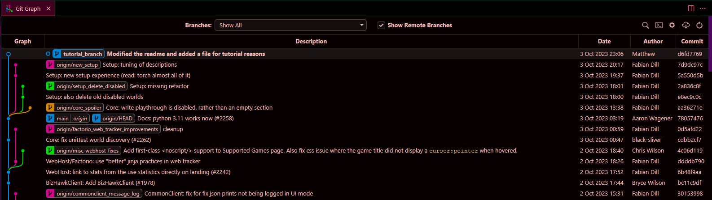
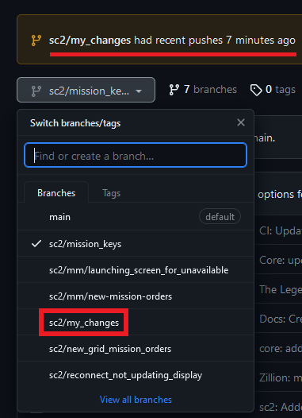

# Git
So you want to know how to use git. Here's an overly-detailed explanation to get you started.

## What is git?
Git is version-control software (VCS). It's basically a save button on steroids, and it is integral to working on code as part of a team. Once you learn the ropes, it's also good for solo projects and a variety of other tasks related to saving, storing, sharing, and versioning of files.

Basic git has a command-line interface (CLI). That means you need to run it in a terminal, such as Windows command prompt, Windows Powershell, bash (Linux terminal), etc. This is not as scary as it sounds, command-line tools have a lot of patterns to make them learnable. If you don't like it after trying it, there are many GUI (Graphical User Interface) tools built on git, that are basically the same things with a UI and buttons. Code editors such as vscode or PyCharm have some git integration in that department. There are also standalone tools, I've heard of Sourcetree and Kraken as examples.

## Installation
See the [official installation guide](https://git-scm.com/book/en/v2/Getting-Started-Installing-Git) for installation instructions. Most people reading this are probably on Windows, which entails downloading and installing the git-for-windows project. There is a "thumbdrive edition", which doesn't change any settings. This means you can run it from a thumbdrive and uninstalling is as easy as deleting a folder, but the downside is you have to do some extra configuration and lose some QOL features. I would recommend the full install unless you're working off someone else's computer / a thumb drive.

I'll give some recommendations for installation options here:
* Installation location unchanged from `C:/Program Files/` unless you have a reason not to put things there
  * Note Program Files/ requires administrator privileges to read/write to, so you can install elsewhere if you see yourself messing with the install often or you don't have admin privileges for some reason
* For "Select Components":
  * the "Open Git Bash here" option is nice to have; it lets you open a git-provided terminal (git-bash) in any folder by right-clicking your explorer window
  * Check "associate .sh files to be run with bash" (Unless you already have something associated with bash)
  * You probably don't need git scalar. Not sure what it is, but it's a microsoft thing that runs in the background. It says it makes git faster in big repos, but I've worked in >1M line repos without it so I doubt it's worth
* Choosing the default editor used by Git
  * If you have VScodium / VS Code installed, use that
  * If you don't, use Notepad++
  * If you have them installed but the installer goes grey when you select them, go to "Select other editor as Git's default editor" and enter the path to the .exe files for each. For vscode, add a `--wait` to the end
    * Example: I have vscodium installed outside Program Files/, my line looks like `C:\Tools\vscode\VSCodium.exe --wait`.
  * As a last resort, use vim. It comes packaged with git so should always be available
* Adjusting the name of the initial branch in repositories: Override to "main", it's what everyone (including AP) uses nowadays
* Adjusting your PATH environment: Git from the command line and also from 3rd-Party Software
  * This makes sure you can use git from any terminal, not just git-bash
* Let git install SSH
* For SSL, judge how much you trust microsoft and use the OpenSSL Library
* Line endings: Checkout as-is, commit Unix-style line endings. Or go Windows-style, it really doesn't matter
* `git pull` behaviour: I'm a rebase man, and will always recommend rebase. Any option can work, see the "Rebasing and merging" section for what this means
* Default the rest

**NOTE**: If you have any open terminal windows when you install something, you have to close and re-open them for the terminal to "see" the new installation.

**Technical explanation**: This is because installations add themselves to a special variable called "PATH", which you can look up under Windows "Edit the system environment varibles" and double-clicking "Path". Note there's two options, one for all users on your machine and that gets added for just your account. Windows terminals only load this information on startup, so existing terminals don't see the installation. You can theoretically manually add this to the PATH within an existing terminal if you're attached to it for some reason.


## Getting started
### Terminals
git is a command-line tool. So we need a command-line. You can use the builtin Windows command-prompt (cmd), which looks like monospace white text on a black screen. For git I'd recommend git-bash, which comes packaged with git and has some extra colour highlights and information (but is still monospace text on a dark screen). git-bash is unix-style, so some basic commands are a little different from cmd. You can find a tutorial on both in [This little tutorial I wrote](./terminal_tutorial.md)

**Note**: copy-paste on git-bash doesn't use ctrl+c / ctrl+v. Use `ctrl+insert` to copy and `shift-insert` to paste. ctrl+c cancels the currently-running program. On cmd, ctrl+c can do both.

### Download something with git
When getting someone else's code or files through git, the first operation we do is a "clone". This means we just get the files and git information from their source, called a "repository".

First you need a URL. A project will have a page somewhere, usually github (though it could be gitlab or bitbucket, I won't judge). There should be a big button somewhere that will give you the url, often labeled "Code", "Clone", or both.

The archipelago github page is here: https://github.com/ArchipelagoMW/Archipelago. Near the top-right, there's a big green "<> Code" button, and when you click on it a box will appear containing a url you can copy. Currently, I have `https://github.com/ArchipelagoMW/Archipelago.git`.

Now in your terminal, navigate to where you want your archipelago folder to go. If you're in `E:/example`, archipelago will end up in `E:/example/Archipelago/`, so no need to label the folder archipelago yourself. Then you will run `git clone <url>`.

```bash
$ cd /e/example/
$ git clone https://github.com/ArchipelagoMW/Archipelago.git
# This will take a few seconds
$ ls
Archipelago/
$ cd Archipelago  # I forget to do this _every_ time
```
If you're on git bash, you will see a little cyan '(main)' on your command prompt at this point

The first and most common thing to do with git is to check status:
```bash
$ git status
On branch main
Your branch is up to date with 'origin/main'.

nothing to commit, working tree clean
```

You can open this folder in explorer and all your files will be here. You can even run from source right away if you have Python installed.

If you change or add a file, running `git status` again will let you know what's up.
```
$ echo new file contents > new_file.txt
$ git status
Untracked files:
  (use "git add <file>..." to include in what will be committed)
        new_file.txt
```

### Make a new git repository
Maybe you don't want to get someone else's files from github, but rather make your own. You'll have to know where you want to host your repository.
* If you're a free user making something public, you can use github, gitlab, or bitbucket. You'll need an account, and there should be a button somewhere on your page to "create a new repository".
  * By default, github and gitlab will include a few checkboxes to specify if you want to start with a description and a license, and then will give you on-screen instructions for downloading the initialized repository locally or uploading an existing folder as the contents of this new repository.
* If you're a corporate user setting up with a company, you can use one of the above providers but your company will probably need some kind of paid plan and sort out the server infrastructure for themselves. "The cloud" is just someone else's computer, and many company policies are concerned with whose computer that is and may want to provide the server machine themselves.
  * This is normally something to talk through with IT. If your company has a software department, they probably already have this infrastructure.
* If you don't care about sharing between computers / other people, and only care about having branches and commits in a single local folder, you can navigate to that folder in a terminal and run `git init`.

## Theory
*Vocabulary*: commit

So why go to all this trouble to download a pack of files? The important thing is that git remembers its history, and you can go back in history to any checkpoint. Google docs has a little panel where you can see change history, think something like that, but with checkpoints intentionally marked by the person saving files (generally with the assumption that things are functional at that checkpoint), and those checkpoints are coordinated across files. Such a checkpoint is called a "commit".


### Example -- developer
Let's say I have a codebase with a few files, and everything currently works. I'm a developer, and I want to add some features, and that means while I'm between changes the code won't run -- it's got half-completed code that doesn't make sense in the same way a half-complete sentence isn't a valid sentence. Once I've made my changes and I've checked things work, I can turn my changes into a commit. Now those changes are packaged together, I can flip to other people's changes and flip back, and I can send my changes out for other people to sync up to them. I and others can jump between commits without getting half-complete code.

### Alternate timelines and parallel universes
*Vocabulary*: branch, checkout

Once you're able to go back in time, there's a question. What happens if I got back in time and do something differently than the first time around? Well, now I've branched the timeline. This is really common in development, and we usually call the different branches "branches".

In this example, someone worked off commit B and made changes C and D. Perhaps someone else also started at B, but they made their own changes E and F.
```
A --- B --- C --- D     <--- branch 1
      \
       --- E --- F     <--- branch 2
```

Git doesn't just let us go back and forward in time, we can also change to different branches. We call such a change-over, which sets the files on your machine to what it was at that commit, a "checkout"

### Worked example -- preamble
Let's modify our archipelago install in a simple way. We'll add a text file, so no coding knowledge required.

#### Politeness
We'll get to merging later, but suffice to say the default branch we start on, "main", is maintained by the primary developers of a project. We can change our local version of it, but we can't sync that with everyone else without the maintainers' approval. It's considered the tidy and polite thing to do to make our changes on a branch, and let the maintainers review the changes before getting them to main themselves. As such, we will first make a branch to work off.

### Worked example
*Vocabulary*: stage, add, restore, commit message, log
```bash
# always start with git status
$ git status
On branch main   # you should now know what this means
Your branch is up to date with 'origin/main'.

Untracked files:
  (use "git add <file>..." to include in what will be committed)
        new_file.txt

nothing added to commit but untracked files present (use "git add" to track)

# We have local changes. I'll get rid of them in this case
# git clean removes all untracked files. -f says I'm sure, please remove them. git clean --help will open the git clean documentation
$ git clean -f

# make a branch called "tutorial_branch" and switch to it
# -b means "create this branch", and error if it exists
$ git checkout -b tutorial_branch
Switched to a new branch 'tutorial_branch'

# check the status of our branches, listing them and highlighting the current one
$ git branch
  main
* tutorial_branch

# I'll now add a file and modify a file. Any modification will do, you can change only text files if you don't want to break anything
# I'll change README.md (the documentation on the front page of the github), and add a file called my_file.txt
# You can do this in your editor of choice, I'll use the terminal because it's easier to record and reproduce
$ echo some changes >> README.md  # '>>' means append instead of overwrite
$ echo file contents > my_file.txt
$ git status
On branch tutorial_branch
Changes not staged for commit:
  (use "git add <file>..." to update what will be committed)
  (use "git restore <file>..." to discard changes in working directory)
        modified:   README.md

Untracked files:
  (use "git add <file>..." to include in what will be committed)
        my_file.txt

no changes added to commit (use "git add" and/or "git commit -a")

# notice git is already telling us what to do!
# We can use 'git add' to add files to our commit (called "staging")
# We can use 'git restore' to discard changes to existing files.
# Restore isn't an option for my_file.txt because it's new and doesn't have a history
# I'll add everything
$ git add my_file.txt README.md
# you may get warnings about CRLF; this is whitespace stuff, it shouldn't matter
$ git status
On branch tutorial_branch
Changes to be committed:
  (use "git restore --staged <file>..." to unstage)
        modified:   README.md
        new file:   my_file.txt

# At this point, we can make our changes into a commit.
# I'm going to unstage the changes for further example material, but you can skip to `git commit`
# Let's say we have second thoughts about our changes and want to unstage them, or we added a file we don't want in our commit
# git tells us what to do! `git restore --staged <file>`
$ git restore --staged README.md
$ git status
On branch tutorial_branch
Changes to be committed:
  (use "git restore --staged <file>..." to unstage)
        new file:   my_file.txt

Changes not staged for commit:
  (use "git add <file>..." to update what will be committed)
  (use "git restore <file>..." to discard changes in working directory)
        modified:   README.md

# Note if we have a staged file, and we make modifications, our new changes don't get staged. We can just run `git add` to capture those changes as well
# This is part of why it's so important to just run `git status` all the time, it helps you keep track of what state everything is in.
# Let's add README.md back to our staged commit.
# The '*' syntax means "all files", it's useful if you've changed many files and want them all
$ git add *
$ git status
On branch tutorial_branch
Changes to be committed:
  (use "git restore --staged <file>..." to unstage)
        modified:   README.md
        new file:   my_file.txt

# Now lets make a commit. Every commit is required to have a commit message, and it's better to be descriptive
$ git commit -m "Modified the readme and added a file for tutorial reasons"
[tutorial_branch d6fd7769] Modified the readme and added a file for tutorial reasons
 2 files changed, 2 insertions(+)
 create mode 100644 my_file.txt
$ git status
On branch tutorial_branch
nothing to commit, working tree clean  # This line should make sense by now

# We now have our changes saved, and you can open my_file.txt and see the modifications.
# We can switch back to main at any time
$ git checkout main
Switched to branch 'main'
Your branch is up to date with 'origin/main'.

# Notice how our changes to my_file.txt and README.md disappear
# We can get them back by switching back
# '-' means the last branch we were on before this one
$ git checkout -
Switched to branch 'tutorial_branch'

# We can view the commit history in-terminal by looking at the log
# This can also give you an idea of how descriptive devs like their commit messages
$ git log
commit d6fd7769728f3f5da16934c12e0f51538e9cadc9 (HEAD -> tutorial_branch)
Author: Matthew <my email>
Date:   Tue Oct 3 23:06:37 2023 -0700

    Modified the readme and added a file for tutorial reasons

commit 78057476f309c3c012b5534b83a2d25c6b3b2a42 (origin/main, origin/HEAD, main)
Author: Aaron Wagener <another email>
Date:   Tue Oct 3 05:19:09 2023 -0500

    Docs: python 3.11 works now (#2258)

    * Docs: python 3.11 works now

    * change to py 3.12 unsupported

commit cdbb2cf7b769eb6614d63bc2233e1ba01635f5dc
Author: black-sliver <59490463+black-sliver@users.noreply.github.com>
Date:   Tue Oct 3 09:47:22 2023 +0200

    Core: fix unittest world discovery (#2262)
# Navigate the log with up / down / pageup / pagedown
# Press `q` to exit the log
```
The log is honestly not the best representation of the commit history. I'd recommend an IDE extension or a GUI git tool to give a better visualization. I personally use the Git Graph extension in VS Code:


I hope some of the potential of git is apparent at this point, but there's still some problems we don't know how to solve.

### Branch proliferation
*Vocabulary*: fast-forward, rebase, merge, merge conflict

If people making changes constantly branch the timeline, how do we avoid having a million different versions of a project? We need a way to cross the streams and merge the branches back together. There's actually 3 ways to do that: "fast-forward", "merge", and "rebase".

#### Fast-forward
Fast-forward, or fast-forward merge, is the simplest strategy. If we have branch A, someone branches to branch B and makes a change, and wants to merge back... there's no conflict. Everything in A is already in B, so we just take what's on B and put it on A.
```
 X --- A                <--- Branch A
        \
         --- B          <--- Branch B
```
Fast-forward B on A:
```
 X --- A --- B          <--- Branch A
```

#### Merge
Merge is what it sounds like. It takes the changes on one branch, and merges them into another in a merge-commit. Git Graph visualizes that like this, if it helps, with blue merging into purple:


```
 X --- Y --- A              <--- Branch A
        \
         --- Z --- B        <--- Branch B
```
Merge B into A:
```
 X --- Y --- A ------ A'      <--- Branch A
        \           /
         --- Z --- B          <--- Branch B
```

#### Rebase
In the case of a rebase, we take one branch and paste it on the other.

```
 X --- Y --- A              <--- Branch A
        \
         --- Z --- B        <--- Branch B
```
Rebase A onto B
```
 X --- Y --- Z --- B --- A      <--- Branch A
```

Some people have preference of rebase vs merge. I prefer rebase myself, and my workplaces have used it. If there's no conflicts, it isn't more trouble to do one over the other, but I find the rebase commit history is easier to reason about, just a chain of "A then B then C".

#### Merge Conflicts
But what happens if we try and merge or rebase branches that both changed the same file? Well, git has our backs, and can still automatically apply changes over each other so long as they don't touch the same parts of a file. But what happens if we do that?

We have a file that reads: "My awesome text"
Branch A changes it to:    "some changes"
Branch B changes it to:    "fdshkjasfkljh"

Now we want to rebase A onto B. What happens?

Well, git tells us it can't do that, and asks us to resolve the conflict
```bash
$ git checkout main
Switched to branch 'main'
Your branch is up to date with 'origin/main'.
$ git checkout -b rebase_tutorial
Switched to a new branch 'rebase_tutorial'

$ echo fdshkjasfkljh >> README.md

$ git status
On branch rebase_tutorial
Changes not staged for commit:
  (use "git add <file>..." to update what will be committed)
  (use "git restore <file>..." to discard changes in working directory)
        modified:   README.md

no changes added to commit (use "git add" and/or "git commit -a")
$ git add *
$ git status
On branch rebase_tutorial
Changes to be committed:
  (use "git restore --staged <file>..." to unstage)
        modified:   README.md

$ git commit -m "modifying readme.md"
[rebase_tutorial 9e3c8f7f] modifying readme.md
 1 file changed, 1 insertion(+)

# This is the syntax to rebase, btw. The current branch is being pasted onto `tutorial_branch`
# `git merge <branchname>` would do the same, but as a merge instead of a rebase
$ git rebase tutorial_branch
Auto-merging README.md
CONFLICT (content): Merge conflict in README.md
error: could not apply 9e3c8f7f... modifying readme.md
hint: Resolve all conflicts manually, mark them as resolved with
hint: "git add/rm <conflicted_files>", then run "git rebase --continue".
hint: You can instead skip this commit: run "git rebase --skip".
hint: To abort and get back to the state before "git rebase", run "git rebase --abort".
Could not apply 9e3c8f7f... modifying readme.md
```

Git says we have to resolve the conflict manually, then tells us how to tell git how to do that. It even tells us how to give up, or skip this commit if we're rebasing multiple commits. You should generally resolve the conflicts, though it can be painful.

Running `git status` now will tell us what files have a conflict
```
Unmerged paths:
  (use "git restore --staged <file>..." to unstage)
  (use "git add <file>..." to mark resolution)
        both modified:   README.md
```
At the bottom of README.md, I see:
```
Please refer to our [code of conduct.](/docs/code_of_conduct.md)
<<<<<<< HEAD
some changes
=======
fdshkjasfkljh
>>>>>>> 9e3c8f7f (modifying readme.md)
```
Git has shown us both versions of the change, and we can cut / copy / paste what we want. vscode even highlights that series of 7 `>` characters nice and bright so I can see what's going on. Note that this process is the same between merge and rebase, except the labelling of (Current Change) vs (Incoming Change) is swapped.

I'm going to accept "some changes" and go back to the command-line, where I'll do what git tells me to resolve the conflict
```
$ git add README.md
$ git rebase --continue
Successfully rebased and updated refs/heads/rebase_tutorial.
```

In practice, branches shouldn't live long as developers and users want to stay on the same code. This means merge conflicts tend to be small. In the case of very big conflicts, though, resolving conflicts with rebasing can take longer. Why? Because merging compacts everything into one commit, and you resolve the conflicts in one shot. With rebasing, you have to resolve the conflicts one commit at a time. I think rebasing generally leads to the nicer and more understandable commit history, so I'd recommend using rebasing and only doing a merge if you have a really nasty conflict you don't want to have to rebase around. You may want to take a different approach for your own projects.

This is probably the scariest part of git as a newcomer. It's not uncommon to mess it up and feel bad the first time or two, but once you get the hang of it it's easy. Generally big scary merge conflicts are more a problem of team / work organization than of git, and why it's important for developers to talk with each other to make sure they don't overwrite each others' code; otherwise, one of them will have to clean up the mess.

## Remotes
*Vocabulary*: remote, fetch, pull, push, force-push

So we have our changes locally, and now we want to share them with our friends. Or maybe other people have changes, and we want them locally. What do?

Simple example: Someone has updated Archipelago main since we `clone`d it back at the start of this tutorial. We want those changes on our local copy of `main`. Luckily, we made sure to keep all our local changes to our own branches, like `tutorial_branch`, meaning changes to `main` can be fast-forwarded onto our local `main`. We pull changes to our local repository with `git pull`:

```bash
$ git checkout main
Switched to branch 'main'
Your branch is behind 'origin/main' by 1 commit, and can be fast-forwarded.
  (use "git pull" to update your local branch)
$ git pull
Updating cdbb2cf7..78057476
Fast-forward
 docs/running from source.md | 4 ++--
 1 file changed, 2 insertions(+), 2 deletions(-)
```
Git even tells you what changed when you pulled.

The URL we pulled from is called a "remote"; we pulled from the remote called "origin" in this case. More on that later.

Note that `git checkout main` won't always tell you that you're behind origin/main; if in doubt, just `git pull` again. If you want to check for updates without applying them right away, run `git fetch <remote_name> <branch_name>`, or `git fetch origin main` in this case.

### But what is a remote?
As stated before, a remote is a URL for a server we can pull and push commits to and from. You can check your current remotes with `git remote`
```bash
$ git remote
origin
$ git remote get-url origin
https://github.com/ArchipelagoMW/Archipelago.git
```

When we clone a repository, git remembers the URL we cloned from an calls it origin. We can check the url with `get-url`. You can even add new ones, which is quite common when working with Open-Source generally or Archipelago specifically. If you have a github account, you can fork any public repository by clicking the "fork" button on the repository's home page. That will make a copy of that repository under your github projects, including all the branches. You generally don't need that much, and it's possible to make a new repository, add it as a remote, and push a single branch there if you only need one.

### Pulling changes from a remote
Let's add Ziktofel's fork of Archipelago so we can get some Starcraft 2 beta changes.

Just like when cloning, we need a url. Ziktofel's fork is at https://github.com/Ziktofel/Archipelago.git. We'll add it as a remote, fetch from it so git knows about the branches there, then change to one of those branches. I happen to know `sc2-next` is where all the cool sc2 features are.

```bash
$ git remote add ziktofel https://github.com/Ziktofel/Archipelago.git
$ git remote
origin
ziktofel
$ git fetch ziktofel sc2-next
# this took a hot second
$ git checkout sc2-next
Switched to a new branch 'sc2-next'
branch 'sc2-next' set up to track 'ziktofel/sc2-next'.
$ git branch
  main
  rebase_tutorial
* sc2-next
  tutorial_branch
```
Now we have branches for sc2-next and Archipelago main, all in one repository. You can add more remotes for every world developer you'd like, and you can switch to any of their branches and `git pull` to them to get the latest stuff. You can even combine branches, by branching one of them and merging in another. *Remember*: If you modify a branch locally, be prepared to resolve merge conflicts when you pull into it. Better to keep your `pull` branches separate from your modification branches

### Pushing changes to a remote
Say we've made some local changes and we want to share them with the world. In the Archipelago case, we will likely have our own fork we made in github, and we can add that as a remote. Now lets say I have a new branch I've made locally, and I want to put it on the remote.

In symmetry with the command "pull" we have "push". Note that for branches we made locally, git doesn't know where to push _to_. So the first time we push from a branch, we need a special flag to tell git where to push, and after that we can push freely.

```bash
$ git remote add matthew https://github.com/MatthewMarinets/Archipelago.git
$ git checkout -b sc2/my_changes
# `-u <origin_name> <branch_name>` tells git what remote / branch to push to
$ git push -u matthew sc2/my_changes
<lots of text>
$ git push  # The -u flag isn't necessary from here on
Everything up-to-date
```
Sure enough, I can check my fork and the branch has popped up there. Now anyone can pull it for themselves.



### Merge conflicts (again)
If you mix your pushing and pulling branches, or maybe just forget to pull before working on something, you can get merge conflicts on a push or pull. For a pull, git will just ask you to resolve the merge conflict locally. For a push, you have to resolve things on your local branch before pushing.

It's also possible to "force-push", where rather than resolving conflicts you just flat overwrite a remote branch. You should only do this for your own personal branches in your own remotes; if people are reviewing your changes you can overwrite the changes _and_ the history of what they were reviewing right out from under them. It can also create issues if other people want to pull from a branch you just force-pushed to. The syntax is `git push -f`.

Also note that resolving conflicts on a pull will result in a merge-commit. You can override this behaviour to get a rebase-style merge conflict resolution by using `git pull --rebase`.

## Collaboration and Pull Requests
*Vocabulary*: maintainer, open-source, pull request, diff

So now you have code and projects, locally and remote, and can share, upload, and download them freely. What about collaboration?

Remote branches are generally owned and maintained by someone. Open-source means anyone can obtain and use the source-code, but they can't necessarily change the remote without the permission of the maintainer. So how to get permission?

Maintainers generally want to review code going into their branches before letting it in. This is done with something called a Pull Request (PR). As the name implies, it's a contributor's request to have their code pulled into a maintainer's branch. This is more a function of Github than of git, and other git repositories like gitlab and Bitbucket have pull requests as well. You can think of them like forum threads accompanying a diff, with the ability for people to attach comments to any line of code. A "diff" is a difference, showing the changes between the two branches being merged. The reviewer can ask for changes and create tasks, and once they've granted approval they can hit the merge button and merge the changes into their branch.

Pull requests are open for all to see, so you can take a peek at the pull requests of any open-source repository to see what it's like. Like any forum, be respectful and don't derail conversations.

### Non-code contributions
Software isn't only done by programmers. There are also testers, technical writers, UX designers, and people logging issues. Projects will generally define forums where people can offer their help or log bug reports, feature requests, and issues. For Archipelago, this will generally be in a channel somewhere in the Discord. Github also provides an "Issues" tab where bug reports and features can be files. Some maintainers may prefer using github issues for task tracking or forums for discussion that are less likely to derail. If you're unsure, it never hurts to ask.

## Resources
* [Atlassian has some articles on git workflows](https://www.atlassian.com/git/tutorials/comparing-workflows). Note AP and most open-source projects use what they call the Forking Workflow
* [Atlassian has an article going more in-depth into rebasing](https://www.atlassian.com/git/tutorials/rewriting-history/git-rebase)
* [This Atlassian article goes into the discussion of merge vs rebase](https://www.atlassian.com/git/articles/git-team-workflows-merge-or-rebase)
* [The git reference manual](https://git-scm.com/docs). Calling some form of `git <command> --help` will generally open a page somewhere in here, but you can just browse

## Other keywords to search for the curious
* `git <command> --help` will open the help page for that command
* `git reflog` will let you track the last commits you had checked out locally, even if you forgot to put them on a branch somehow
* Squash commits
  * Squash multiple commits into one
  * IDEs / git plugins will generally let you do this in the GUI
  * Doing this in CLI is done with interactive rebase `git rebase -i <range of commits>`, and will open the editor you have configured with git (remember that install option?)
* `git cherry-pick` lets you cherry-pick commits from one branch onto another without a full merge or rebase
* Undoing history:
  * `git revert` makes a commit that undoes a prior commit
  * `git restore` sets a branch back in time to a previous commit. Comes in hard and soft variants, where soft keeps the changes locally but unstaged and hard throws them out
* `git lfs` is large-file storage. I don't know how it works either

## Command index
```bash
git clone <url>                   # clone a new repository
git status                        # check the status of the current repository
git clean [-f|-i]                 # remove untracked files. -f removes without asking, -i does it interactively
git checkout -b <branch_name>     # make a new branch and switch to it. Error if the branch already exists
git checkout <branch_name>        # checkout an existing branch
git branch                        # list the existing branches
git add <files>                   # stage changes to files for a commit
git add *                         # stage all current changes for a commit
git restore --staged <files>      # un-stage changes to files from a commit
git commit -m "<message>"         # Commit currently staged-changes, with a (hopefully descriptive) message
git commit --amend                # Edit the last commit message in a text editor. Great for fixing typos
git rebase <branch_name>          # update the current branch to have its commits after the commits on <branch_name>
git merge <branch_name>           # update the current branch with a new commit, merging in changes from <branch_name>
git remote                        # list the currently registered remotes
git remote get-url <remote_name>  # print the URL for <remote_name>
git fetch <remote> <branch>       # fetch a remote branch to make it available locally for checkout
git pull                          # pull the latest from the remote to the current branch
git pull <remote> <branch>        # arguments are necessary if git doesn't know the remote branch to pull from
git pull --rebase                 # pull and if there's a conflict, rebase changes instead of merging them
git push                          # push the current branch to a remote repository
git push -u <remote> <branch>     # use -u on the first push to set the remote branch to push to
git push -f                       # ONLY for personal remotes: force-push; overwrite the remote branch without attempting to merge anything
```
