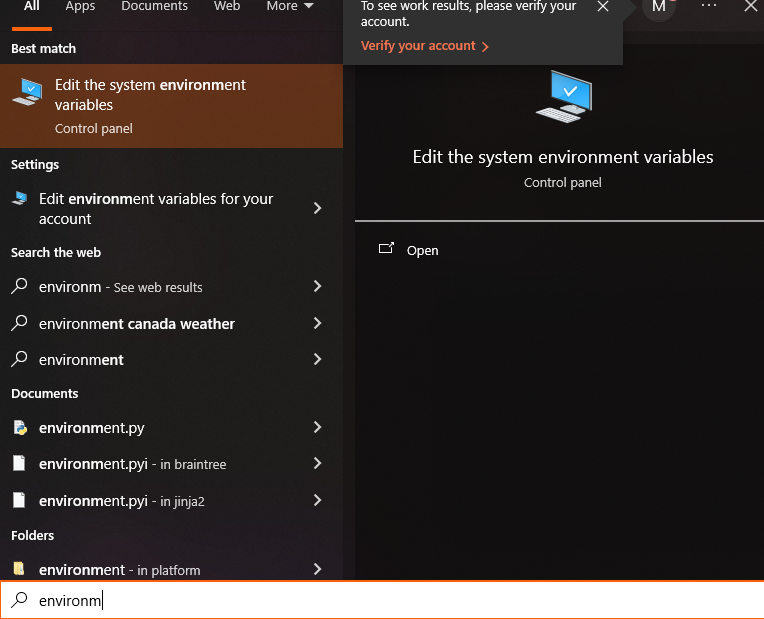
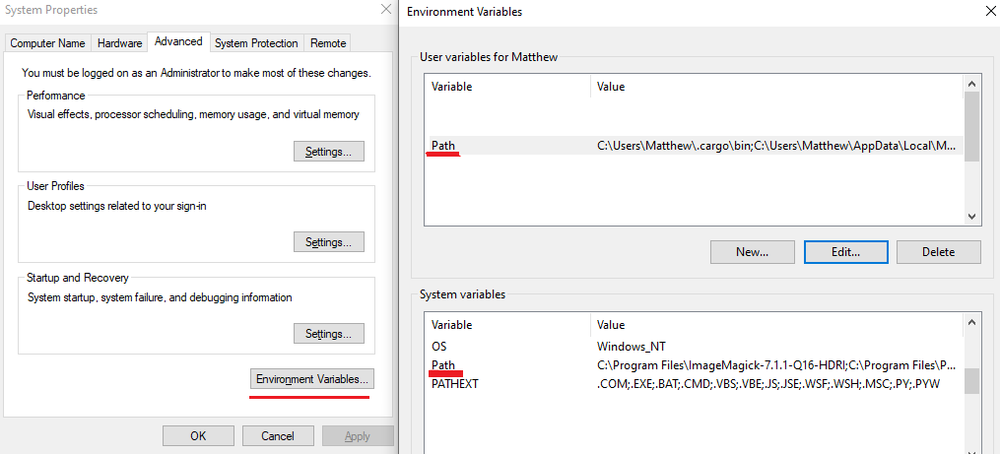
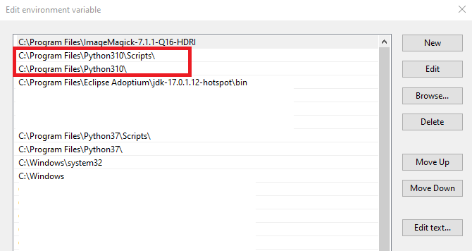

# How to play the beta on sc2-next
## Install tools
You'll need:
* git (see [the installation notes in the guide](git.md#installation))
* Python 3.10 or 3.11 ([download here, don't get 3.12](https://www.python.org/downloads/))
  * Note Python should be installed from the installer, not from winget
  * I recommend doing a system-wide installation, and future instructions will largely assume that's the case
* You can use a GUI git tool like GitHub for Desktop or SourceTree instead of baseline git; I will give command-line instructions as they're easier to type

### Verifying git installation
* Open a command prompt (start menu, type "cmd" and hit enter)
* Enter commands by typing them out and hitting enter
  * `where git` -- should print a path to some git.exe somewhere; doesn't matter where

### Verifying Python installations
* Open a command prompt (start menu, type "cmd" and hit enter)
* Enter commands by typing them out and hitting enter
  1. `where python`
     * should return a path in `C:/Program Files/Python311` (or `Python310` for 3.10)
     * **OR** can return a path in `C:/Users` (user installation), unless it's in `AppData/Local/Microsoft/WindowsApps` -- that's the winget version and it breaks
     * If multiple paths appear, we only care about the first one; ie if the winget version is installed but second in the list, we don't care.
  2. `python --version` should print the version -- make sure it's 3.10 or 3.11
* Check the path for Python -- it's broken for a lot of people for some reason
  1. In the start menu, type "env" to click on the option "Modify the System Environment Variables" (Fig. 1)
  2. In the "System Properties" popup, click "Environment Variables" (Fig. 2)
  3. If you installed Python system-wide, look in the bottom box; if you installed it just for your user, look in the top box
  4. Find the "Path" Variable and double-click it to edit it
  5. Verify these two paths are in the list: (These are for 3.11, 3.10 will have `Python310`, and assume system-wide installation) (Fig. 3)
     * `C:\Program Files\Python311\`
     * `C:\Program Files\Python311\Scripts\`
     * Make sure these appear _before_ any other python installation directory if you have multiple
  6. If any path is missing, you can add it (and verify Python exists in that directory). *If you make updates, be sure to restart command-prompt before continuing*
  7. Check `where python` and `python --version` again if you made changes

Figure 1: Opening the environment variables window

Figure 2: The variables to edit

Figure 3: Adding the variables near the top of the list

## Downloading from git
* The sc2 beta fork is here: https://github.com/Ziktofel/Archipelago.git
* Decide what folder you want to put your installation in. I will use `D:/example` for an example
* Open command-prompt (type `cmd` in the start menu and hit enter)
* Navigate to the desired folder
  * Change drives by typing the drive name (e.g. `d:` will change to the D:/ drive)
  * See what folders you can go to by typing `dir`
  * Change folders by typing `cd <foldername>` (e.g. `cd example` will change directory to example)
    * auto-complete a folder name by hitting tab
  * run `git clone https://github.com/Ziktofel/Archipelago.git` to clone (download) the repository
    * This may take several seconds
  * `cd` into the new `Archipelago/` directory
  * run `git status` to verify the git repository is initialized correctly
    * This should say what branch you're on; if you're not on `sc2-next`, change to it with `git checkout sc2-next`
  * In future, you can get the latest updates by just running `git pull` from this location

## Running
It is recommended that the first time you run from source, you run from a command-prompt. This is because if there is an error, the command prompt will stay open so you can read it and ask for help. You can run by double-clicking files in the explorer, but the terminal will close instantly on error.

* Open or an Administrator command-prompt in `D:/example/Archipelago`
  * You can get an administrator terminal when you start cmd by right-clicking it and selecting "run as administrator"
* run `python setup.py` in the administrator command prompt
  * This should ask to download all third party-libraries; hit enter to proceed
  * If this errors, share the error message in the discord to get help (and we can update this guide, hopefully)
  * Otherwise, we should be ready to go; command-prompt is optional from here on
* Close the administrator command-prompt -- we shouldn't need it anymore, and it's not secure to leave administrator command-prompts open for long periods in general
* Run `Launcher.py` to get your template yamls
* Run `Generate.py` to generate a game with yamls in the Players/ folder
* Run `MultiServer.py` to locally-host a generated world
  * Tip: on command-line, you can run `MultiServer.py <output_zip_name>` to instantly start the server without going through a file-selection screen
* Run `Starcraft2Client.py` to start up the sc2 client
  * Run `/download_data` in the client to get the latest map and mod files
* Report issues to the github at https://github.com/Ziktofel/Archipelago/issues
* Have fun!

## Details / other ways of running for technical users
Some people have extra requirements for maintaining their system or running the code
* If you're debugging, get set up with an IDE
  * I recommend vscode with the pylance extension (Visual Studio Code, not the same as Visual Studio)
  * Many developers use PyCharm, which is a Python-specific but high-quality IDE
  * If you're more technical than I'd expect any reader of this guide to be, Vim and Emacs are also options
  * For the love of god, do not use Visual Studio
* If you need to keep your system Python libraries clean (ie don't want Archipelago 3rd party libraries interfering with other Python projects), you can use `python venv` to make a project-specific Python install
