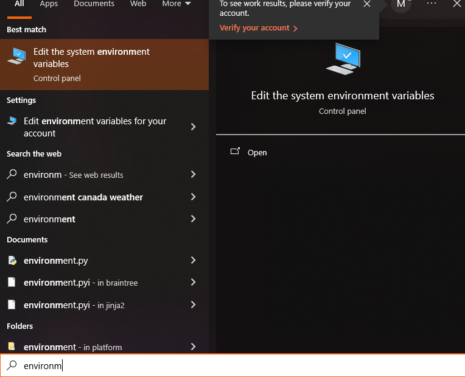
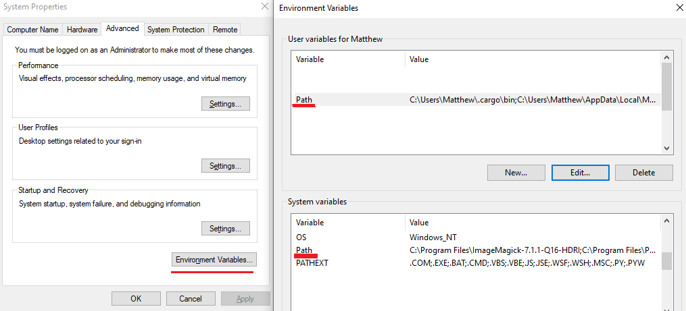
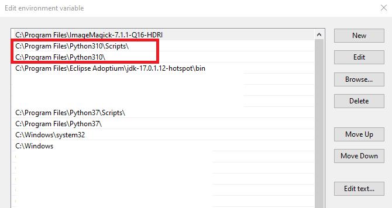

# How to play the beta on sc2-next
This guide explains how to start playing the in-development beta version of Archipelago sc2.
The main guide assumes users are installing on Windows.
See the [Linux section](#running-the-beta-from-source-linux-users) for Linux instructions.

## Which version?
Starcraft 2 doesn't release major content updates on every Archipelago version.
A mapping of starcraft 2 updates to Archipelago updates is provided:

* version 5, current beta (not part of any core Archipelago release)
* version 4, Archipelago release 0.6.4: **The raceswap release**
* version 3, Archipelago release 0.4.5: **The multi-campaign release**
* version 2, Archipelago release 0.4.3: **The WoL extended items release**
* version 1, Archipelago release 0.3.2: **The Original WoL-only release**

## Through an .apworld download
The latest beta version currently doesn't have an .apworld download link.

<!--
Now that the beta cycle has merged to Archipelago main, a downloadable apworld is hosted
[here](https://github.com/MatthewMarinets/Archipelago/releases/tag/v0.6.4).

Note this .apworld will still see minor updates as bugfixes are merged to main before 0.6.4 goes live.

Also note that this .apworld conflicts with the live sc2.apworld;
in a multiworld, either all sc2 players must be playing the live version,
or all sc2 players must be playing the beta version.

To install it:
* Back up the old sc2.apworld in your Archipelago install
  * For example, by moving it to a folder called `worlds_disabled/` outside of `worlds/`
* Download sc2.apworld from the link above, and place it in `<archipelago install>/worlds/`
  * Note it _does not_ go in `custom_worlds/`, as it's replacing a core world
  * If the old `worlds/sc2.apworld` is not removed, the two will conflict and your yaml may count as invalid

To use it:
* Run the launcher and click "Generate Template Settings" -> Open to generate a template yaml
  * Remember to delete the templates you're not using so they don't count as part of your world
* Fill out your yaml with desired settings
* Run ArchipelagoGenerate.exe to generate
  * This will generate an output .zip file in `output/`
* Upload your generated multiworld to the [archipelago.gg uploads page](https://archipelago.gg/uploads)
* Create a room and connect as usual
* Note that the .apworld can't update the website's tracker, so webtracker won't work
  * It's possible to check out the new webtracker by hosting the webhost locally,
    but that only works if you're [running from source](#running-the-beta-from-source)

To revert back to the live sc2 apworld:
* Delete your downloaded `worlds/sc2.apworld`
* Move your backed-up `worlds_disabled/sc2.apworld` back to `worlds/`
-->

# Running the beta from source (Windows users)
## Install tools
You'll need:
* git (see [the installation notes in the guide](git.md#installation))
* Python 3.11 ~ 3.13 ([download here](https://www.python.org/downloads/))
  * Note you're looking for the windows executable in the table on a version's page,
    _not_ "Download Python Install Manager"
  * Note Python should be installed from the installer, not from winget
  * I recommend doing a system-wide installation, and future instructions will largely assume that's the case
* You can use a GUI git tool like GitHub for Desktop or SourceTree instead of baseline git;
  I will give command-line instructions as they're easier to type

### Verifying git installation
* Open a command prompt (start menu, type "cmd" and hit enter)
* Enter commands by typing them out and hitting enter
  * `where git` -- should print a path to some git.exe somewhere; doesn't matter where

### Verifying Python installations
* Open a command prompt (start menu, type "cmd" and hit enter)
* Enter commands by typing them out and hitting enter
  1. `where python`
     * should return a path in `C:/Program Files/Python312` (or `Python311` for 3.11)
     * **OR** can return a path in `C:/Users` (user installation), unless it's in
       `AppData/Local/Microsoft/WindowsApps` -- that's the winget version and it breaks
     * If multiple paths appear, we only care about the first one; ie if the winget version is installed but second in the list, we don't care.
  2. `python --version` should print the version -- make sure it's 3.11 or 3.12
* Check the path for Python -- it's broken for a lot of people for some reason
  1. In the start menu, type "env" to click on the option "Modify the System Environment Variables" (Fig. 1)
  2. In the "System Properties" popup, click "Environment Variables" (Fig. 2)
  3. If you installed Python system-wide, look in the bottom box; if you installed it just for your user, look in the top box
  4. Find the "Path" Variable and double-click it to edit it
  5. Verify these two paths are in the list: (These are for 3.12, and assume system-wide installation) (Fig. 3)
     * `C:\Program Files\Python312\`
     * `C:\Program Files\Python312\Scripts\`
     * Make sure these appear _before_ any other python installation directory if you have multiple
  6. If any path is missing, you can add it (and verify Python exists in that directory).
     *If you make updates, be sure to restart command-prompt before continuing*
  7. Check `where python` and `python --version` again if you made changes



Figure 1: Opening the environment variables window



Figure 2: The variables to edit



Figure 3: Adding the variables near the top of the list

## Downloading from git
* Decide what folder you want to put your installation in. I will use `D:/example` for an example
* Open command-prompt (type `cmd` in the start menu and hit enter)
* Navigate to the desired folder
  * Change drives by typing the drive name (e.g. `d:` will change to the D:/ drive)
  * See what folders you can go to by typing `dir`
  * Change folders by typing `cd <foldername>` (e.g. `cd example` will change directory to example)
    * "cd" is short for "change directory"
    * `cd ..` will go up one folder level (e.g. from `D:/example/subfolder` to `D:/example`)
    * auto-complete a folder name by hitting tab
  * run `git clone https://github.com/archipelago-sc2/Archipelago.git` to clone (download) the repository
    * This may take several seconds
    * This will create a new folder called `Archipelago/`; you can check it exists with `dir`
  * `cd` into the new `Archipelago/` folder
* run `git status` to verify the git repository is initialized correctly
  * This should say what branch you're on; if you're not on `sc2-next`, change to it with `git checkout sc2-next`
* In future, you can get the latest updates by just running `git pull` from this location

## Running
It is recommended that the first time you run from source, you run from a command-prompt.
This is because if there is an error, the command prompt will stay open so you can read it and ask for help.
You can run by double-clicking files in the explorer, but the terminal will close instantly on error.

* Open or an Administrator command-prompt in `D:/example/Archipelago`
  * You can get an administrator terminal when you start cmd by right-clicking it and selecting "run as administrator"
* run `python setup.py` in the administrator command prompt
  * This should ask to download all third party-libraries; hit enter to proceed
    * If it bugs you about cx_freeze errors, these are skippable and you can still hit enter to proceed
  * We expect this to error with "error: no commands supplied"
  * If there is some other error (usually complaining about cx_freeze), something went wrong with installing libraries.
    * Share the error message in the discord to get help (and we can update this guide, hopefully)
  * Otherwise, we should be ready to go; command-prompt is optional from here on
* Close the administrator command-prompt -- we shouldn't need it anymore, and it's not secure to leave administrator command-prompts open for long periods in general
* Run `Launcher.py` to get your template yamls
  * This is done with the "Generate Template Options" command in the launcher
* Run `Generate.py` to generate a game with yamls in the Players/ folder
* Run `MultiServer.py` to locally-host a generated world
  * Tip: on command-line, you can run `MultiServer.py <output_zip_name>` to instantly start the server without going through a file-selection screen
* Run `Starcraft2Client.py` to start up the sc2 client
  * [Update the map and mod files](#updating-the-mod-files) by running `/download_data`
* Report issues to #sc2-dev thread in the discord, or on the github at https://github.com/archipelago-sc2/Archipelago/issues
* Have fun!

## Updating the mod files
The simplest way to get the latest files is to run `/download_data` in the client.
This fetches and installs the files from the [ap-sc2-data releases page](https://github.com/archipelago-sc2/Archipelago-SC2-data/releases).

### Installing manually from the releases page
You generally shouldn't have to do this, but you can just do what `/download_data` does manually
by going to the [releases page](https://github.com/archipelago-sc2/Archipelago-SC2-data/releases),
selecting the Archipelago-SC2Data.zip artifact of the API version you want, unzipping,
and putting the contents of the Maps/ and Mods/ folders into the corresponding folders of your sc2 install.

### Installing manually from the actions page
This also generally shouldn't be necessary, though it does allow selecting the mod files from a particular branch or push.
So if you want to get the files for a feature which is still in PR (say, to assist in testing a new unit), you can follow these steps.
* Sign into a github account. Make one if you don't have one
* Go to the [Github Actions page for the map/mod repository](https://github.com/archipelago-sc2/Archipelago-SC2-data/actions)
* Click the build (white text) for the latest build labeled with the desired branch
* Click the "Archipelago-SC2Data" link in the Artifacts section, near the bottom of the page. This requires being signed into github. This should download a .zip file
* Unpack the .zip; it should contain folders named `Maps/` and `Mods/`. Paste the contents of these folders into the Maps/ and Mods/ folders of your sc2 install

### Building locally
This is an alternate way to get the maps, more useful for developers.
* Clone the archipelago-sc2-data repository or your fork of it.
  Fork from [the APsc2 organization's repo](https://github.com/archipelago-sc2/Archipelago-SC2-data) or clone that fork directly
* For windows users:
  * Open `build_release_package.sh` and `Maps/ArchipelagoCampaign/build.sh` in an editor like vscode or Notepad++.
    Change the line ending to Unix-style (LF)
    * In vscode, this is done by clicking the little "CRLF" in the bottom-bar or running the "Change End of Line Sequence" task, and selecting LF
    * In Notepad++, this is done with Edit -> EOL Conversion -> LF
  * Ensure you have WSL (Windows Subsystem for Linux) enabled. Use the WSL terminal to execute .sh scripts
* Run `./build_release_package.sh` in a terminal. This should build the maps, and will take a minute or two
* The result should appear in the target/ directory. Get the contained Maps/ and Mods/ folders to your sc2 install
  * A neat trick is to create a symlink from `<sc2 install>/Maps/ArchipelagoCampaign` to `<repo clone>/target/Maps/ArchipelagoCampaign` (and similar for mods)

## Details / other ways of running for technical users
Some people have extra requirements for maintaining their system or running the code
* If you're debugging, get set up with an IDE
  * I recommend vscode with the pylance extension (Visual Studio Code, not the same as Visual Studio)
  * Many developers use PyCharm, which is a Python-specific but high-quality IDE
  * If you're more technical than I'd expect any reader of this guide to be, Vim and Emacs are also options
  * For the love of god, do not use Visual Studio
* If you need to keep your system Python libraries clean (ie don't want Archipelago 3rd party libraries interfering with other Python projects),
  you can use `python venv` to make a project-specific Python install

## Troubleshooting
### Uninstalling all libraries
* This hopefully shouldn't be necessary, but might be if things got installed in user installs when Python / Archipelago wants it in at the system-level
* in cmd, run:
  * `python -m pip freeze > reqs.txt` to list all currently installed Python libraries in reqs.txt
  * `python -m pip uninstall -r reqs.txt` to uninstall everything in reqs.txt
  * `del reqs.txt` to delete the reqs.txt file

### [Deprecated] Dependency download failing with "can't find rust/cargo"
This was a temporary problem caused by an update to a dependency library called `jellyfish` around Dec 2024.
It should no longer be a problem.
`jellyfish` uses Rust in addition to Python for some extra speed. It precompiles for a wide variety of operating systems and Python versions.
As of 8 December 2024, a new version (1.1.2) came out, which does not yet have precompiled downloads for most versions of Python on Windows.
1.1.0 has working downloads on Windows for Python 3.8 ~ 3.12, so you can run `pip install jellyfish==1.1.0`
to install this version, then run `pip install -r requirements.txt` to install the remaining requirements, and you should be good to go.
Note running `setup.py` when dependencies are partially installed won't work, as it may try to upgrade jellyfish as part of installing the other dependencies.
Alternatively, you can install Cargo from the Rust foundation so pip will automatically build the library for your Python version and platform.

You can check the downloadable versions of jellyfish on [their PyPI page](https://pypi.org/project/jellyfish/#files).

# Running the beta from source (Linux users)
The steps to run the client from source are fundamentally the same on Linux, with a few minor differences:
* Installing git and Python is much easier
* Python is referred to as `python3` on the command-line instead of `python`
* Python will generally be a "managed installation", meaning you have to use a venv to install dependencies

Actually running the game is harder, and not fully covered here.
A script similar to the Linux setup instructions [on the archipelago.gg website](https://archipelago.gg/tutorial/Starcraft%202/setup_en#running-in-linux)
will be necessary.

## Install tools
* You will need Python version 3.11+ and git
* These are likely already installed. If not, use your distribution's package manager.
  * Using `apt` (the package manager for Debian-based distros) as an example:
```sh
sudo apt install git
sudo apt install python3
```

## Verify tools installation
In a terminal, run the following commands to check that the programs are installed and on the path:
```sh
python3 --version
git --version
```

You should see an output something like:
```sh
$ python3 --version
Python 3.12.3
$ git --version
git version 2.43.0
```

## Downloading from git
* Decide what folder you want to put your installation in. I will use `~/code` for an example
* Open a terminal in that directory
  * You can navigate between folders in a terminal with `cd <folder name>`
    * `cd ..` goes up one folder level
    * `ls` prints the files and folders in the current folder
* run `git clone https://github.com/archipelago-sc2/Archipelago.git` to clone (download) the repository
  * This may take several seconds
  * This will create a new folder called `Archipelago/`; you can check it exists with `ls`
  * `cd` into the new `Archipelago/` folder
* run `git status` to verify the git repository is initialized correctly
  * This should say what branch you're on; if you're not on `sc2-next`, change to it with `git checkout sc2-next`
* In future, you can get the latest updates by just running `git pull` from this location

## Running
### First time running any source-client
Archipelago has dependencies that it will try to install.
With Python installed via system package manager, this will only work in a venv.
Create one in the terminal with:
```sh
python -m venv venv
```

You can "activate" the venv (use the dependencies installed there) in any terminal by going to your
archipelago install and running:
```sh
. ./venv/bin/activate
```

At this point, you should be able to run the Archipelago client by running the following:
```sh
python3 Launcher.py "Starcraft 2 Client"
```

**Note that missions will not start without wine configuration**.

### Running missions with wine
Starcraft 2 doesn't have a native linux installation, so we have to use `wine`.
Proton also goes through `wine`,
you'll just have to dig up the precise filepaths within the Proton installation.

The rough steps are:
* Get a battle.net executable
* Run that through wine
* Use that to install starcraft 2
* Once that works, you can either start starcraft 2 through battle.net in future, or run it directly
  through `SC2Switcher` (boots straight into sc2 or a specific map, but requires signing in in-game)
* Create a script to launch Archipelago's Launcher.py while setting all the necessary
  wine environment variables to run Battle.net / starcraft 2
  * I will call this script `sc2client.sh` for this example
* Use this script to launch the Archipelago client in future
  * You will need to make the script executable the first time (`chmod +x ./sc2client.sh`)
  * Use `/download_data` within the client to download map/mod data

In my experience, the Battle.net launcher did not work with out-of-the-box wine.
Pages for different games simply wouldn't render.
I had to install a newer version through ProtonPlus (`10.15-staging-tkg`).

The default Lutris configuration for Battle.net also didn't work,
it required adding a symlink at `$(WINEPREFIX)/drive_c/Program Files (x86)/Battle.net` pointing to
`$(WINEPREFIX)/Battle.net`.

#### When the game can run under Lutris
With things working via Lutris, it's possible to export and modify a Lutris run script following the
[instructions on archipelago.gg](https://archipelago.gg/tutorial/Starcraft%202/setup_en#running-in-linux).
The only things that have to change is that the last two lines of code change from finding and running
`ARCHIPELAGO` and instead run the client via Python:
```sh
python3 Launcher.py "Starcraft 2 Client" -- $@
```

#### Without Lutris
You will need to create a script that sets the necessary wine environment variables and launches the client.
A skeleton script is provided; paths will have to be updated to point towards file locatinos on your system.
* `WINE` points to the version of wine that can successfully run Starcraft 2
* `WINEPREFIX` points to the WinePrefix (the mini-Windows file system) where the starcraft 2 installation lives
* `SC2PATH` should point to the `Program Files (x86)/Starcraft II` folder within the wine prefix
```sh
#!/usr/bin/env bash
# Wine
export WINEARCH="win64"
export WINE="/home/phaneros/.local/share/lutris/runners/wine/wine-10.15-staging-tkg-amd64/bin/wine"
export WINEPREFIX="/home/phaneros/Games/battlenet"

# Archipelago
export SC2PF=WineLinux
export PROTOCOL_BUFFERS_PYTHON_IMPLEMENTATION=python
export SC2PATH="/home/phaneros/Games/battlenet/drive_c/Program Files (x86)/StarCraft II/"

# Command
python3 ./Launcher.py "Starcraft 2 Client" -- $@
```

#### Quick starts
The `-- $@` at the end of these scripts forwards arguments to the starcraft 2 client.
You can use this to quickly-connect from the command-line,
or make another script to quickly launch and connect to a slot.

To connect to the room at `archipelago.gg:57777` and slot "phaneros" as an example:
```sh
. ./venv/bin/activate
./sc2client.sh --connect archipelago.gg:57777 --name phaneros
```

## Updating the mod files
The simplest way to get the latest files is to run `/download_data` in the client.
This fetches and installs the files from the [ap-sc2-data releases page](https://github.com/archipelago-sc2/Archipelago-SC2-data/releases).

### Installing manually from the releases page
You generally shouldn't have to do this, but you can just do what `/download_data` does manually
by going to the [releases page](https://github.com/archipelago-sc2/Archipelago-SC2-data/releases),
selecting the Archipelago-SC2Data.zip artifact of the API version you want, unzipping,
and putting the contents of the Maps/ and Mods/ folders into the corresponding folders of your sc2 install.
